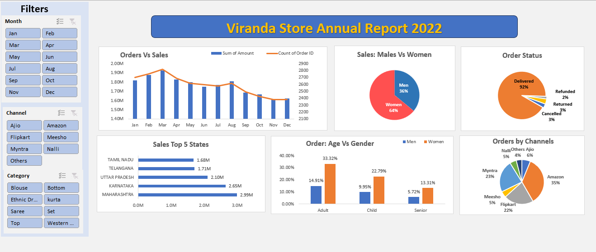

# Vrinda Store Sales Analysis Dashboard – Microsoft Excel
## Dashboard Preview

## Project Overview
This project focuses on the **analysis of retail sales performance for Vrinda Store** using Microsoft Excel. The objective was to transform raw transactional data into a **clean, structured, and analysis-ready dataset**, and subsequently develop an **interactive dashboard** to derive actionable business insights.

The project emphasizes both **data cleaning and exploratory analysis**, followed by KPI development and visualization across customer demographics, sales channels, geography, and order status.

## Data Cleaning & Preparation
Performed comprehensive data cleaning and preprocessing in Excel, including:
- Removal of duplicate and inconsistent records
- Standardization of categorical fields (gender, age group, order status, channels)
- Handling missing and invalid values
- Creation of derived columns for age groups, order categories, and time-based analysis
- Validation of sales and order metrics for analytical consistency

## Key Metrics & KPIs
- Total Sales and Order Volume
- Monthly Sales and Order Trends
- Sales Distribution by Gender
- Order Status Breakdown (Delivered, Cancelled, Returned, Refunded)
- Channel-wise Sales Contribution
- State-wise Sales Performance
- Age Group vs Gender Order Distribution

## Analytical Components

### Time-Series Analysis
- Monthly trend analysis of sales and order volume
- Identification of peak and low-performing periods

### Customer Demographics Analysis
- Gender-based sales contribution
- Age group vs gender comparison to understand purchasing behavior

### Channel Performance Analysis
- Sales contribution across online marketplaces and channels
- Identification of top-performing sales channels

### Geographic Analysis
- Top-performing states based on sales value
- Regional contribution assessment

### Order Fulfillment Analysis
- Order status distribution to evaluate fulfillment efficiency and return rates

## Dashboard Interactivity
- Interactive slicers for:
  - Month
  - Sales Channel
  - Product Category
- Dynamic filtering across all visuals without modifying source data

## Tools & Techniques Used
- Microsoft Excel
  - Data cleaning and preprocessing
  - Pivot Tables and Pivot Charts
  - Calculated fields and measures
  - Conditional formatting
  - Slicers for interactivity
- Dashboard design principles focused on clarity and usability

No external tools, add-ins, or macros were used.

## Business Insights
- Majority of sales are driven by female customers
- Adult age group contributes the highest order volume
- A small number of sales channels contribute a significant share of total revenue
- High delivery rate indicates efficient order fulfillment, with minimal returns and refunds

## Files Included
- `Vrinda Store Data Analysis.xlsx` – Cleaned dataset and interactive dashboard
- Dashboard preview image
